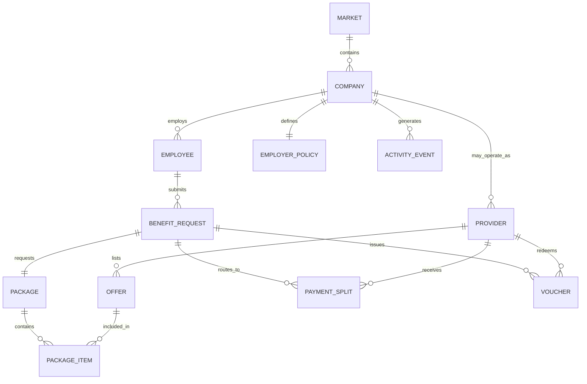
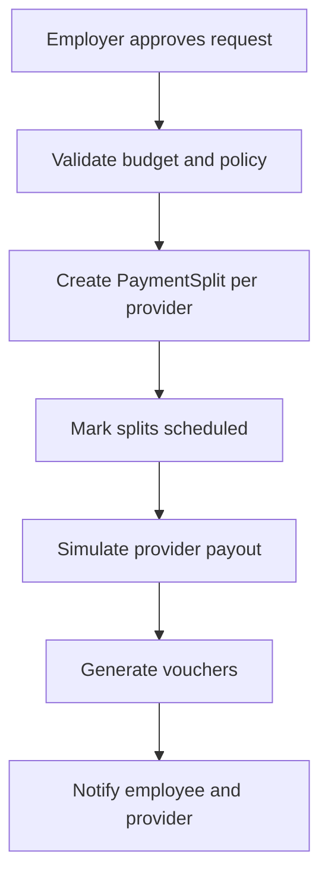
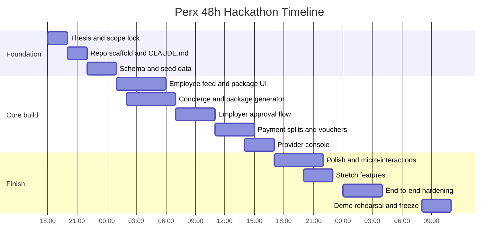

# Zero to Win Product Plan for TeamSystem Perx

## Executive summary

The TeamSystem Perx challenge is not asking for a generic employee-benefits catalog. It is asking for a marketplace that solves two problems at once: make employer-funded benefits genuinely attractive to employees, and make the experience sticky enough that people return regularly instead of opening the app once per quarter. The brief is explicit that the product must support three actors, route payment directly to providers rather than to employees, feel Albania-first while remaining internationalizable, and show at least one live AI-driven or engagement feature in the minimum working demo. Judging weights are also unusually top-heavy toward originality: Creativity and Innovation is 45%, Experience and Working Prototype is 35%, and Smart Use of AI is 20%. fileciteturn0file1

That weighting has a direct product implication: the winning strategy is **not** to maximize breadth. It is to build a narrow but polished loop with a strong “wow” mechanic that judges can understand in under a minute. The best concept for that constraint is an **AI-native benefits marketplace** where employees do not browse static categories first; instead, they ask for an outcome such as “I want something relaxing under 12,000 ALL,” and the system turns marketplace inventory into a multi-provider package, submits it for employer approval, splits the simulated payment, and issues provider-side vouchers. This aligns almost line-by-line with the brief’s emphasis on conversational discovery, smart bundling, employer insight, and habit-forming engagement. fileciteturn0file1

The zero-to-win plan therefore centers on one thesis: **Perx should feel less like an HR portal and more like a premium consumer app for discovering locally relevant experiences funded by employer benefit budgets**. The product should present a Tirana-first feed, package-generation AI, an employer approval console, provider confirmations, and one or two carefully chosen engagement loops such as limited-time drops or team wellness streaks. Everything else should be judged by one question: does it improve the score on the rubric more than it risks the live demo? fileciteturn0file1

On the implementation side, Claude Code is well suited to a 48-hour hackathon because Anthropic describes it as an agentic coding tool that can read a codebase, edit files, run commands, and work across terminal, IDE, desktop, and browser surfaces; it also supports persistent project instructions via `CLAUDE.md` and multi-agent workflows for parallel work streams. Anthropic’s current model guidance recommends Claude Opus 4.8 for the most complex reasoning and long-horizon coding tasks, while positioning lighter models for speed-sensitive flows. That makes Claude Code plus Claude Opus 4.8 a strong fit for both building the product quickly and powering the highest-value AI user journeys in the demo. citeturn6view0turn7view1turn13view0

## Challenge reading and winning thesis

The brief imposes a clear set of non-negotiables. Perx must be a two-sided marketplace with **employees, employers, and providers**; employees browse offers or multi-provider packages, employers fund and approve, providers list offers, and platform money flow is provider-directed rather than employee-directed. A company can also participate as employer, provider, or both. The solution should be architected for multiple languages and currencies, but the showcased product should feel native to Albania and specifically meaningful for a Tirana employee. It should also answer the stickiness question: “Would I open this again next week?” Finally, the team must seed its own data and simulate payments rather than relying on real rails or supplied infrastructure. fileciteturn0file1

Those requirements imply that the winning submission must solve for **experience design first**, not enterprise completeness. A benefits platform that merely provides filters, categories, and an approval queue will satisfy the marketplace requirement, but it will underperform on the largest rubric category because it will look predictable. The brief itself hints at more differentiated mechanics, including AI concierge interactions, gamified goals, social features, seasonal drops, year-in-benefits summaries, smart bundles, and employer insights. The best way to exploit those hints without overbuilding is to treat them as **a ranked design repertoire** rather than a feature list. fileciteturn0file1

The strongest product thesis is therefore:

**Perx is an AI-powered benefits marketplace that converts employer welfare budgets into curated, locally relevant packages employees actually want to use, with a feed and recommendation layer that makes the app feel alive between approvals.**

That thesis satisfies every line of the brief:

| Challenge requirement from brief | Product response |
|---|---|
| Three actors and marketplace behavior | Separate employee, employer, and provider experiences with one shared request object |
| Employee can select one or more offers, ideally across providers | AI-generated “packages” bundle inventory across providers |
| Employer approves and payment goes directly to provider(s) | Approval creates payment splits and vouchers, not employee reimbursements |
| Built for Albania, ready for the world | Tirana-first seeded content, ALL currency, localization tables, country-specific provider catalogs |
| Habit, not chore | Feed, drops, recommendations, streaks, and package rediscovery |
| AI earns its place | Conversational concierge, smart bundle generator, employer-side insight summaries |
| Favor working core loop over breadth | One polished end-to-end journey, with shallow extensions only after demo reliability is secured |

This is the core user and system loop the judges should see:

```mermaid
flowchart LR
    A[Employee opens Perx] --> B[Discovers offer or asks AI concierge]
    B --> C[Perx generates package from one or more providers]
    C --> D[Employee submits request]
    D --> E[Employer reviews and approves]
    E --> F[Simulated payment split created]
    F --> G[Providers receive payment confirmation]
    G --> H[Employee receives voucher or redemption pass]
    H --> I[Feed updates with progress, streak, new drops]
```



The strategic insight is that the **package generator** is the keystone. It is the shortest route to scoring on all three criteria at once. It creates originality because the core unit becomes a lifestyle outcome rather than a discount code; it improves prototype quality because it drives a memorable employee journey and a visible approval/payment chain; and it gives AI a clear product purpose instead of a bolted-on chatbot. That is exactly the kind of feature the brief is signaling. fileciteturn0file1

## Judging criteria mapping and score-maximizing deliverables

Because the official rubric allocates 45% to creativity, 35% to working product quality, and 20% to AI, any roadmap that spends disproportionate effort on admin depth, settings, or infrastructure will misallocate scarce hackathon time. That is not a subjective preference; it follows directly from the published scoring structure. The practical consequence is that every major deliverable should be chosen for **multi-criterion leverage**. fileciteturn0file1

The table below is an internal scoring model, not the official judges’ rubric. It translates the published weighting into build priorities.

| Deliverable | Creativity impact | Prototype impact | AI impact | Why it matters |
|---|---:|---:|---:|---|
| AI concierge that turns natural language into a package | Very high | High | Very high | Most efficient “wow” feature; directly maps to conversational discovery and smart bundling |
| Multi-provider package detail and checkout flow | High | Very high | Medium | Shows distinctive marketplace value and satisfies minimum demo requirements |
| Employer approval queue with policy summary | Medium | High | High | Makes AI useful on the employer side and completes the approval loop |
| Simulated payment routing and provider confirmations | Medium | Very high | Low | Converts a concept demo into a robust product demo |
| Tirana-first discovery feed with new drops | High | High | Medium | Answers the “habit, not chore” requirement |
| Team challenges or streaks | High | Medium | Low | Differentiates experience, but should not block the core loop |
| Provider self-serve onboarding/edit offer flow | Medium | Medium | Low | Useful completeness signal, but less critical than the loop itself |
| Internationalization architecture | Medium | Medium | Low | Must be visible, but can stay shallow in the demo |
| Deep analytics dashboard | Low | Medium | Medium | Easy to overbuild; keep lean and insight-led |
| Real payments or real tax logic | Very low | Low | None | Explicitly unnecessary for the challenge and high-risk in 48 hours |

From this mapping, the **zero-to-win build order** becomes clear:

| Priority | Deliverable | Why it ranks here |
|---|---|---|
| Essential | AI concierge → package builder → request submit | This is the primary “hook” judges will remember |
| Essential | Employer approval → policy check → payment split | Mandatory for minimum demo and product credibility |
| Essential | Provider confirmation → voucher issued | Closes the economic loop and demonstrates the marketplace |
| Essential | Feed/home screen with localized Tirana content | Needed to make the product feel sticky and consumer-grade |
| Valuable stretch | Limited-time drops and team challenge | Big creativity gain if demo remains stable |
| Valuable stretch | Employer insights summaries | Strong AI reinforcement with limited engineering cost |
| Nice after stability | Provider onboarding and localization switcher | Good completeness signals, but not essential to win |
| Defer | Complex admin tooling, role-based auth, real integrations | Low scoring leverage per hour spent |

The winning framing for judges is not “we built many features.” It is: **we built the feature combination that best matches the weighted rubric**. That is a stronger strategic story than a broader backlog. fileciteturn0file1

## Product blueprint and prioritized feature set

The product should be positioned as **Perx Routes** or **Perx Packages**: outcome-driven bundles that combine several local services into one employer-approved benefit experience. This is important because it transforms the marketplace object from a static offer into a differentiated unit of value. A gym pass alone is ordinary; a “Tirana Reset” bundle that combines yoga, brunch, and spa recovery is memorable. The brief explicitly invites smart packages that bundle complementary offers from several providers, which gives this concept unusually strong source alignment. fileciteturn0file1

### MVP must-have set

The MVP must do only what is necessary to tell a complete story, but it must do it cleanly.

| MVP feature | What ships | Acceptance condition |
|---|---|---|
| Employee feed | Personalized cards, remaining budget, featured local packages, category chips | Employee can discover at least one package without AI |
| AI concierge | Chat input, suggested prompts, package-generation result | Natural-language request returns a valid package using seeded offers |
| Package detail | Provider list, price breakdown, “why this fits,” submit CTA | Employee can review and submit package |
| Employer approval queue | Pending requests, policy status, approve/reject actions | Employer can approve one submitted package |
| Simulated payment split | Ledger entries for each provider | Approval creates provider-specific payment records |
| Provider inbox | Payment received, voucher created, redemption status | Provider sees confirmation and voucher payload |
| Voucher confirmation | Code/QR placeholder, validity window, redemption instructions | Employee receives benefit artifact after approval |
| Demo role switcher | Employee/employer/provider demo personas | Judges can move through the journey quickly without auth friction |

### Stretch set for the back half of the hackathon

These features meaningfully boost creativity and retention if the core demo is already stable.

| Stretch feature | Why it is worth doing |
|---|---|
| Friday Drops or Weekend Picks | Makes the app feel alive and worth reopening |
| Team wellness streak | Adds light social motivation without building a social network |
| Employer AI insights | Demonstrates value beyond employee-side discovery |
| One-click re-run of last month’s package | Strong UX delight with low implementation cost |
| Albania/Italy market switcher | Shows international architecture visibly |
| Provider bundle participation score | Adds marketplace intelligence and upgrade path |

### Post-hack polish if time remains

These should only happen if the MVP demo path is already bulletproof.

| Post-hack polish | Notes |
|---|---|
| Provider onboarding wizard | Nice, but not worth destabilizing the main demo |
| Receipt and invoice PDFs | Good realism, low strategic value |
| Calendar scheduling or redemption slots | Useful extension, but not required |
| Referral/gifting flows | Interesting, but secondary to the core loop |
| Rich analytics dashboard | Keep to one or two insight cards at hackathon scale |

The product surface should be intentionally compact. One high-quality employee journey, one fast employer decision surface, and one lightweight provider confirmation surface will feel far more polished than six inconsistently finished work areas. That tradeoff is completely consistent with the brief’s instruction to favor a working core loop over breadth. fileciteturn0file1

## User journeys and interaction design

The three personas in the brief are not equal in demo importance. The employee experience should carry most of the visual sophistication because that is where discovery, delight, and AI differentiation live. The employer journey should be optimized for confidence and speed. The provider journey should prove economic routing and marketplace legitimacy with the least possible complexity. fileciteturn0file1

### Employee journey

| Step | Screen | Key UI elements | Micro-interactions | Success condition |
|---|---|---|---|---|
| Arrival | Home feed | Remaining budget, greeting, featured packages, “Fresh in Tirana” rail | Budget card fills in with animated ring; cards shimmer on load | User immediately understands this is budget-backed discovery |
| Intent capture | AI concierge panel | Suggested prompts: “Relaxing under 12,000 ALL,” “Healthy week,” “Learn a new skill” | Prompt pills slide into input; send button morphs into progress indicator | User can express need in plain language |
| Package generation | AI result sheet | Package name, rationale, provider cards, total cost, remaining budget after purchase | Staged reveal: title → items → total → rationale | Output feels designed, not dumped |
| Review | Package detail | Provider map/list, savings badge, policy badge, submit CTA, alternatives | Provider cards expand with short descriptions and redemption notes | User trusts the package and can compare quickly |
| Submission | Confirmation drawer | Pending status, approval ETA, request ID | Confetti should be restrained; status timeline animates forward | User feels progress, not dead-end waiting |
| Fulfillment | Voucher screen | Redemption code, validity period, package items | Copyable code, “Add to wallet” placeholder, subtle pulse on status complete | Benefit feel becomes tangible |
| Retention | Return-to-feed state | “New this week,” “Complete your wellness streak,” “Use remaining 8,200 ALL” | Personalized nudge chips, recent activity ribbon | App feels worth reopening |

**Useful sample screen copy**

- “Your benefits, curated for how you actually live.”
- “You have 18,500 ALL left this month.”
- “We built this package because you’ve preferred wellness + light food experiences and asked for something relaxing.”
- “Submitted to AlbaTech HR. Funds will go directly to providers after approval.”

### Employer journey

| Step | Screen | Key UI elements | Micro-interactions | Success condition |
|---|---|---|---|---|
| Arrival | Approval dashboard | Pending requests, monthly utilization, policy alerts | Cards sort by urgency on load | Employer can see what needs action immediately |
| Review | Request drawer | Employee, package items, category tags, total, policy summary | “Within policy” badge appears instantly before details expand | Trust and speed are prioritized |
| Decision | Approve/reject interaction | Single confirm modal, reason optional | Approve button triggers split-payment preview before final confirm | Approval feels controlled and clear |
| Routing | Payment split view | Provider-level amounts, timestamps, voucher generation status | Each provider line transitions to “paid” sequentially | Judges see the system doing real work |
| Insight | Lightweight analytics | Top categories, unused budget, AI suggestion | Insight card rotates once per visit rather than cluttering the page | Employer value is broader than approvals |

**Employer AI summary pattern**

- “This request is within monthly budget and approved categories.”
- “The package spans three providers and uses 60% of this employee’s remaining allocation.”
- “Employees at your company have shown rising preference for wellness and food bundles; consider more recovery and healthy meal providers.”

### Provider journey

| Step | Screen | Key UI elements | Micro-interactions | Success condition |
|---|---|---|---|---|
| Arrival | Provider console | Offers, incoming payments, voucher status | New payment badge pulses once, then settles | Provider sees tangible marketplace value |
| Payment notice | Payment details | Package source, gross amount, voucher references | Status flips from “scheduled” to “received” | Demonstrates direct routing |
| Fulfillment | Voucher list | Voucher code, expiry, redemption toggle | Redeem action requires confirmation to avoid accidental change | Provider role is clearly functional |
| Catalog management | Offer editor | Title, category, price, availability, tag list | Save action updates offer card inline | Platform looks like a real marketplace |

The interaction priority is to make every persona’s first action obvious. Avoid dashboards that greet the user with blank tables. Seed every surface with realistic information, visual hierarchy, and one default primary CTA. That matters because the brief is evaluating both delight and actual functionality, and first impressions heavily shape perceived polish in hackathon judging. fileciteturn0file1

## AI system design with Claude Code Opus 4.8

Anthropic’s current documentation recommends Claude Opus 4.8 when the workload is complex reasoning, long-horizon agentic coding, or high-autonomy work, and Claude Code itself is designed to operate across a real codebase, edit files, run commands, and carry persistent project instructions via `CLAUDE.md`. Anthropic also notes that Opus 4.8 has a 1M-token context window, up to 128k synchronous output, adaptive thinking, and moderate comparative latency, with the `effort` parameter defaulting to `high` across surfaces including Claude Code. This is a strong fit for hackathon development and for the runtime turns where Perx needs high-quality package generation or employer reasoning. citeturn6view0turn7view1turn7view2turn7view3

At the same time, Anthropic’s latency guidance explicitly recommends choosing the right model for the use case, shortening prompts and outputs, and streaming when responsiveness matters. Anthropic’s rate-limit documentation also explains that throughput can improve materially with prompt caching, because cached input tokens do not count toward ITPM for most models. That implies a practical pattern for Perx: reserve Opus 4.8 for **high-stakes reasoning turns**, keep prompts compact and structured, stream the concierge response, and cache repeated system instructions, catalog descriptors, and policy scaffolding. citeturn13view0turn15view0

### Recommended AI architecture

| AI job | Recommended model role | Why |
|---|---|---|
| Codebase generation, refactors, QA assistance during build | Claude Code with Opus 4.8 | Best capability for multi-file reasoning and rapid implementation |
| Runtime employee package generation | Opus 4.8 | Highest-value reasoning turn; quality matters more than raw speed |
| Runtime employer policy summary | Opus 4.8 or lighter fallback if rules are mostly deterministic | Policy explanation benefits from nuance, but rules can be precomputed |
| Light tagging, classification, or re-ranking | Fast model or deterministic code | Keep expensive reasoning focused on differentiating moments |
| Demo fallback behavior | Deterministic package builder | Guarantees live demo reliability if AI call fails |

### Prompting strategy

Anthropic recommends being clear and direct, assigning a role through the system prompt, and using XML tags to separate instructions, context, and variable inputs. Anthropic also recommends Structured Outputs when guaranteed JSON conformance is required, and strict tool use when tool calls must exactly match a schema. Those are particularly useful in a hackathon, where brittle parsing is one of the easiest ways to lose a live demo. citeturn11view1turn11view0turn10view0turn11view2

### Conversational concierge

**Purpose**  
Convert natural language into a constrained user intent and then produce one or more candidate packages grounded in local inventory and employer policy.

**Input schema**

```json
{
  "employee": {
    "id": "emp_001",
    "locale": "en-AL",
    "currency": "ALL",
    "remainingBudget": 18500,
    "preferences": ["wellness", "healthy_food", "learning"],
    "history": ["yoga_day_pass", "healthy_brunch"]
  },
  "employerPolicy": {
    "monthlyLimit": 20000,
    "approvalRequiredAbove": 10000,
    "allowedCategories": ["wellness", "food", "learning", "health", "travel", "telecom"],
    "blockedCategories": [],
    "maxProvidersPerPackage": 4
  },
  "marketContext": {
    "city": "Tirana",
    "country": "AL",
    "season": "summer",
    "availableOffers": ["...catalog IDs..."]
  },
  "userRequest": "Find me something relaxing under 12000 ALL this weekend"
}
```

**Output schema**

```json
{
  "intent": {
    "primaryNeed": "relaxation",
    "budgetCap": 12000,
    "timeContext": "weekend",
    "confidence": 0.91
  },
  "packages": [
    {
      "packageId": "pkg_reset_001",
      "packageName": "Tirana Reset",
      "reason": "Matches relaxation + weekend + budget using wellness and light food offers.",
      "items": [
        {"offerId": "ofr_spa_01", "providerId": "prov_nova", "price": 5500},
        {"offerId": "ofr_brunch_01", "providerId": "prov_green", "price": 2200},
        {"offerId": "ofr_yoga_01", "providerId": "prov_motive", "price": 1500}
      ],
      "totalCost": 9200,
      "remainingBudgetAfter": 9300,
      "categoryTags": ["wellness", "food"],
      "policyStatus": "within_policy"
    }
  ],
  "fallbackMessage": null
}
```

**System prompt skeleton**

```xml
<role>
You are Perx Concierge, an AI benefits planner for employer-funded employee benefits.
</role>

<objective>
Generate consumer-grade benefit packages that feel desirable, local, and realistic while staying within employer policy.
</objective>

<hard_rules>
- Use only offers provided in <catalog>.
- Never exceed <policy><budget_cap> unless explicitly allowed.
- Prefer multi-provider bundles when they improve usefulness.
- Output only valid JSON matching the schema.
- If no compliant package exists, return alternatives and explain why.
</hard_rules>

<ranking_logic>
Prioritize policy compliance, local relevance, preference fit, and delight.
</ranking_logic>

<context>
  <employee>...</employee>
  <policy>...</policy>
  <catalog>...</catalog>
  <user_request>...</user_request>
</context>
```

### Package generator

This can either be the same runtime call as the concierge or a second structured call after intent extraction. In practice, splitting the operation into two steps is safer because Anthropic explicitly recommends chaining complex tasks into smaller subtasks for better consistency. citeturn10view0turn11view0

**Job decomposition**
1. Parse the user request into structured intent.
2. Deterministically filter inventory by price, category, company policy, and availability.
3. Ask the model to rank and assemble packages from the filtered candidate set.
4. Validate schema and totals in application code.
5. If validation fails, fall back to deterministic bundling.

That flow creates cleaner failure boundaries than one monolithic prompt.

### Employer insights

**Purpose**  
Turn request and usage data into a concise employer-facing summary that can influence provider mix or budget design.

**Input schema**

```json
{
  "company": {
    "id": "cmp_001",
    "name": "AlbaTech",
    "locale": "en-AL"
  },
  "period": "2026-06",
  "usage": {
    "approvedRequests": 18,
    "topCategories": [
      {"category": "wellness", "count": 9},
      {"category": "food", "count": 7},
      {"category": "learning", "count": 2}
    ],
    "unusedBudgetRate": 0.34
  },
  "currentCatalogCoverage": ["wellness", "food", "learning", "travel"],
  "goal": "Recommend what providers or benefits to add next"
}
```

**Output schema**

```json
{
  "summary": "Wellness-led bundles are outperforming other categories while learning usage is limited.",
  "insights": [
    "34% of budget remains unused this month.",
    "Wellness and food bundles are the most requested combination.",
    "Learning may need better packaging or stronger provider relevance."
  ],
  "recommendedActions": [
    "Add one recovery/wellness provider with weekend availability.",
    "Test a learning-plus-coffee or coworking bundle rather than standalone courses."
  ],
  "confidence": 0.84
}
```

### Fallback behavior

A live hackathon demo should never depend on a single external inference succeeding in real time. The fallback hierarchy should be:

| Failure mode | Fallback |
|---|---|
| API unavailable | Use deterministic package templates keyed to prompt intent |
| JSON parse failure | Retry once with stricter schema-only instruction; then use deterministic package |
| Empty compliant results | Return “best near match” options and explain the limiting policy |
| Slow response | Stream partial UI state and show “package in progress”; fail over after timeout |
| Unexpected content | Filter, strip, and revalidate before rendering |

### Latency and throughput design

Anthropic’s own guidance suggests three particularly relevant tactics for Perx: choose the right model, shorten prompts and expected outputs, and stream responses. Prompt caching is also important because system instructions, catalog descriptors, and policy templates will repeat over many demo requests, and cached inputs improve effective throughput under API limits. citeturn13view0turn15view0

Practical targets for the hackathon:
- Keep runtime AI calls to one or two per demo path.
- Precompute deterministic candidate sets before sending anything to the model.
- Limit runtime output to the exact JSON you need for rendering.
- Stream the concierge’s visible result.
- Cache the system prompt, locale instructions, schema, policy descriptors, and stable catalog summaries.

### Safety and privacy notes

The Perx domain touches potentially sensitive signals: employee preferences, health- or wellness-adjacent selections, employer budget usage, and approval notes. Anthropic’s privacy materials state that personal data may be transferred internationally and describe training-related processing in some service contexts, which is enough to justify a conservative data-minimization posture for the demo. At hackathon scale, the safest design is to send pseudonymous employee IDs, avoid free-text HR comments when possible, avoid medical details entirely, and keep company policies structured rather than narrative. Treat all employee requests as potentially sensitive workplace data even if they appear low risk. citeturn7view5turn6view3

## Data model and technical architecture

The brief requires a seeded marketplace, provider-facing listings, employer approvals, direct provider payment routing, and international-ready architecture. A normalized but compact schema is the best fit. fileciteturn0file1

### Core entities

| Entity | Key fields | Notes |
|---|---|---|
| Market | `id`, `countryCode`, `city`, `defaultCurrency`, `supportedLocales` | Enables Albania-first demo and future expansion |
| Company | `id`, `name`, `roles`, `marketId` | `roles` can include employer, provider, or both |
| Employee | `id`, `companyId`, `locale`, `budgetRemaining`, `preferenceProfile` | Pseudonymous in demo data |
| EmployerPolicy | `companyId`, `monthlyLimit`, `approvalThreshold`, `allowedCategories`, `rulesJson` | Rules used both deterministically and by AI |
| Provider | `id`, `companyId`, `displayName`, `category`, `marketId`, `payoutMethod` | Keeps provider as marketplace participant |
| Offer | `id`, `providerId`, `title`, `category`, `priceMinor`, `currency`, `availabilityJson`, `tags` | All offer pricing stored in minor units |
| Package | `id`, `sourceType`, `title`, `reason`, `totalMinor`, `currency`, `aiGenerated`, `status` | Can be curated or AI-generated |
| PackageItem | `packageId`, `offerId`, `providerId`, `priceMinor`, `sortOrder` | Needed for split routing |
| BenefitRequest | `id`, `employeeId`, `companyId`, `packageId`, `status`, `submittedAt`, `approvedAt` | Central workflow object |
| PaymentSplit | `id`, `benefitRequestId`, `providerId`, `amountMinor`, `status`, `paidAt` | Simulated routing artifact |
| Voucher | `id`, `benefitRequestId`, `providerId`, `code`, `expiresAt`, `status` | Provider and employee fulfillment view |
| ActivityEvent | `id`, `actorType`, `actorId`, `eventType`, `payloadJson`, `createdAt` | Supports timelines and feed recency |
| LocaleString | `key`, `locale`, `value` | Shallow but visible i18n proof |

### ER diagram



### API design

| Endpoint | Method | Purpose |
|---|---|---|
| `/api/feed` | GET | Employee feed cards, featured packages, drops |
| `/api/concierge/intent` | POST | Parse natural-language prompt into structured need |
| `/api/concierge/package` | POST | Generate compliant package candidates |
| `/api/packages/:id` | GET | Package detail with provider breakdown |
| `/api/requests` | POST | Submit package for employer approval |
| `/api/employer/requests` | GET | Pending approval queue |
| `/api/employer/requests/:id/approve` | POST | Approve and create payment splits/vouchers |
| `/api/employer/requests/:id/reject` | POST | Reject with optional reason |
| `/api/providers/:id/payments` | GET | Provider payment confirmations |
| `/api/providers/:id/offers` | GET/POST | Offer list and create/update |
| `/api/insights/company/:id` | GET | Employer insight summaries |
| `/api/localization/config` | GET | Active market locale/currency/category config |

### Proposed Albania seed data

The catalog below is **proposed mock demo data**, not a claim about real commercial arrangements. It is designed to make the product feel appropriately Tirana-first while staying stable and demo-friendly.

| Provider | Category | Example offer | Price |
|---|---|---|---:|
| Motive Studio | Wellness | Yoga day pass | 1,500 ALL |
| Nova Recovery | Wellness | Recovery massage session | 5,500 ALL |
| Green Plate Blloku | Food | Healthy brunch set | 2,200 ALL |
| SkillSprint Tirana | Learning | AI for Excel workshop | 7,500 ALL |
| Tirana Smile Care | Health | Dental cleaning voucher | 4,800 ALL |
| Urban Move | Fitness | Weekly gym pass | 3,500 ALL |
| Weekend South | Travel | Day-trip discount voucher | 3,000 ALL |
| Connect Mobile | Telecom | 20GB data perk | 1,200 ALL |

**Example prebuilt packages**

| Package | Items | Total |
|---|---|---:|
| Tirana Reset | Yoga pass + recovery massage + healthy brunch | 9,200 ALL |
| Healthy Week | Weekly gym pass + brunch + data perk | 6,900 ALL |
| Skill Recharge | AI workshop + coworking-style meal voucher | 9,700 ALL |
| Weekend Escape Lite | Travel voucher + brunch + data perk | 6,400 ALL |

### Localization plan

The brief specifically asks for multiple languages, multiple currencies, and localizable benefit categories. The hackathon implementation should make that visible without overengineering it. fileciteturn0file1

Use this localization contract:

| Layer | Albania demo default | International-ready mechanism |
|---|---|---|
| Locale | `en-AL` with optional `sq-AL` copy table | `LocaleString` table or JSON dictionaries |
| Currency | ALL | Currency code on all monetary entities |
| Category labels | Wellness, Food, Learning, Health, Travel, Telecom | Market-specific category registry |
| Provider availability | Tirana-specific seeded data | Market-scoped provider and offer records |
| Recommendation tone | Tirana-first copy | Locale-specific prompt fragments |

### Simulated payment routing and voucher flow

The brief requires payment to go directly to providers and explicitly allows simulated payments. The cleanest architecture is to create `PaymentSplit` records immediately on approval and then issue vouchers off those split records. fileciteturn0file1

**Routing logic**
1. Employer approves request.
2. System validates package total and company budget.
3. For each package item, create provider-level `PaymentSplit`.
4. Mark split `scheduled`.
5. Background job or synchronous demo action marks split `paid`.
6. One voucher per provider item, or one grouped voucher if the same provider appears multiple times.
7. Employee timeline updates to `approved` → `paid` → `ready`.



## Build system, sprint plan, demo orchestration, and risk control

Claude Code should be used as the team’s force multiplier rather than as an ad hoc autocomplete tool. Anthropic documents that Claude Code can read the codebase, edit files, run commands, integrate with development tools, carry CLAUDE.md instructions, and even coordinate multiple agents or background agents. For a 48-hour build, that means the team should externalize product rules, component conventions, seed-data assumptions, and “never break the demo flow” constraints into a shared `CLAUDE.md` before doing serious implementation. citeturn6view0

### Recommended stack

| Layer | Choice | Why |
|---|---|---|
| Frontend | Next.js + TypeScript | Fast full-stack iteration, routing, SSR/CSR flexibility |
| UI | Tailwind + shadcn/ui | High-quality, hackathon-speed polish |
| Database | SQLite + Prisma or Drizzle | Minimal setup, stable local demo |
| State/data | Server actions or thin REST handlers | Simple enough for a small team |
| AI runtime | Anthropic Messages API with structured outputs | Reliable, explicit schema handling |
| Charts | Recharts or lightweight SVG components | Sufficient for employer insights |
| Auth | Demo persona switcher | Eliminates auth friction and risk |
| Deployment | Vercel or local offline-safe demo build | Choose the more reliable option for the venue |

### Suggested CLAUDE.md spine

```md
# Perx hackathon operating rules

- This repo exists to win the JunctionX Tirana TeamSystem Perx challenge.
- Preserve the live demo path above all else.
- Do not add features that interrupt employee -> employer -> provider flow.
- Use Tirana-first content, ALL currency, and polished consumer-style UI.
- Prefer deterministic fallbacks when AI reliability is uncertain.
- Never break seed data assumptions without updating fixtures and tests.
- All new UI should feel premium, mobile-friendly, and demoable in under 15 seconds.
```

### Forty-eight hour sprint plan

| Time block | Goal | Owner |
|---|---|---|
| Friday opening | Lock thesis, screens, data model, demo story | All |
| Friday block one | Scaffold app, schema, seed data, persona switcher | Full-stack lead + AI/dev support |
| Friday block two | Employee feed and package detail screens | Frontend lead |
| Friday block three | Concierge API and deterministic bundler fallback | AI/backend lead |
| Friday late | Employer queue and approval actions | Full-stack lead |
| Saturday block one | Payment splits, provider inbox, voucher views | Backend + frontend |
| Saturday block two | Polish employee UI, animations, copy, empty states | Design/frontend |
| Saturday block three | Employer insights AI card, drops/streak stretch feature | AI/frontend |
| Saturday late | Fixes, end-to-end tests, seed resets, demo hardening | All |
| Sunday morning | Practice demo, tighten pitch, freeze code | All |
| Sunday before judging | Final bug sweep, local fallback checks, backup video capture | All |

### Sprint timeline



### Acceptance tests

| Test | Pass condition |
|---|---|
| Employee request | User can generate or select a package and submit it |
| Employer approval | Pending request appears within one refresh and can be approved |
| Payment routing | Approval creates one split per provider with correct totals |
| Provider confirmation | Provider sees incoming payment and voucher status |
| AI resilience | If AI fails, deterministic fallback still returns a package |
| Localization proof | Currency and market config can switch without breaking core flow |
| Demo reset | Team can restore app to baseline state in under one minute |

### Demo script and judge walkthrough

The ideal live walkthrough is under four minutes.

| Demo moment | Script |
|---|---|
| Hook | “Most benefit apps feel like chores. Perx turns company perks into personalized experiences employees actually want to open.” |
| Employee context | “This is Elira, a Tirana employee with 20,000 ALL monthly benefit credit funded by her employer.” |
| AI moment | “Instead of browsing a dull catalog, she asks for something relaxing under 12,000 ALL this weekend.” |
| Package reveal | “Perx builds a Tirana Reset package across multiple providers: yoga, recovery, and brunch.” |
| Approval | “She submits it; now HR sees that it is within policy and budget.” |
| Routing | “When HR approves, the system splits the payment directly to each provider.” |
| Provider proof | “Each provider gets confirmation and a voucher is issued to the employee.” |
| Retention angle | “Next week she returns because the feed has new drops, progress, and recommendations—not because HR forced her to.” |
| Closing line | “Built for Albania today, architected for any market tomorrow.” |

This talk track works because it connects every rubric category in sequence: originality, working flow, and meaningful AI. It also keeps the judges focused on the journey, not on implementation details that do not score as highly. fileciteturn0file1

### Risk analysis and fallback plan

| Risk | Likelihood | Impact | Mitigation |
|---|---|---:|---|
| AI response breaks schema | Medium | High | Use Structured Outputs or strict tool use; validate server-side; deterministic fallback |
| Demo internet failure | Medium | High | Persist a fully seeded offline-safe path and record a backup video |
| Overbuilt UI destabilizes flow | High | High | Freeze main journey before stretch features |
| Backend complexity delays polish | Medium | High | Keep provider and employer flows intentionally shallow |
| Team loses time on auth/deployment | High | Medium | Persona switcher and one-click seed reset |
| Weak wow factor despite working demo | Medium | High | Prioritize package-generation reveal and feed polish over admin features |
| Ambiguous Albania relevance | Medium | Medium | Use ALL, Tirana copy, local-feeling package names, and market toggle proof |
| Judges do not notice AI value | Medium | High | Narrate AI decisions explicitly: intent parsing, bundle rationale, employer insight |

### Final polish checklist

| Polish item | Why it matters |
|---|---|
| Fast first paint and seeded content | Dead screens kill confidence instantly |
| One beautiful home screen | It frames the whole product as premium |
| Tight copywriting | Hackathon products win trust through clarity and tone |
| Consistent currency formatting in ALL | Reinforces Albania-first execution |
| Visible policy badge on package detail | Makes employer approval feel credible |
| Sequential payment animation | Lets judges see the marketplace economics operate |
| One strong empty state per role | Prevents unfinished-product vibes |
| Seed reset button | Essential for repeated judging cycles |
| Backup deterministic AI mode | Protects live demo from model variance |
| Short, memorized pitch | Prevents explanation from outrunning the product |

### Presentation tactics

Open with the pain statement from the brief, not with architecture. Then show the employee experience first, because that is where creativity is most legible. Only after the package submission should you move into the employer and provider views. Never let the user interface sit idle while a model is thinking; use streamed or staged loading. End with one sentence about internationalization and one sentence about why the app gets reopened weekly. That closing lands directly on the “built for Albania, ready for the world” and “habit, not chore” pillars from the brief. fileciteturn0file1

The highest-probability winning configuration is therefore simple: **a Tirana-first AI concierge that generates multi-provider benefit packages, a polished approval-and-routing loop that actually works, and just enough engagement design to make the marketplace feel alive**. If the team protects that configuration from scope creep, keeps the demo path deterministic, and uses Claude Code Opus 4.8 as a disciplined implementation accelerator rather than a last-minute patch tool, Perx will align tightly with the challenge brief and maximize its scoring surface across all three judging categories. fileciteturn0file1turn6view0turn7view1turn10view0turn11view2