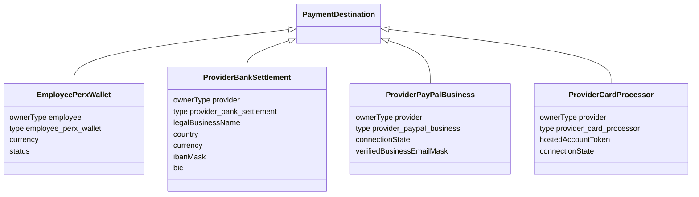

# Perkline architecture

## System boundaries

```text
Next.js App Router
  middleware.ts              edge-safe session verification and role routing
  Server Components          authenticated reads through store accessors
  Route Handlers             Zod + RBAC + ownership + CSRF + rate limits
  src/lib/store.ts           single swappable data boundary
  src/lib/concierge.ts       deterministic eligibility/ranking source of truth
  src/lib/ai-client.ts       optional strict-JSON model adapter with fallback
  src/lib/payment-destination.ts
                              type-specific settlement draft/reset/display rules
```

The in-memory `globalThis` store is deterministic and resettable for judging. Replacing it with a
database should not change UI or business logic.

## Domain boundaries

The welfare domain is centered on:

`Market · Company · Employee · EmployerPolicy · Provider · Offer · PerxRoute · BenefitRequest · PaymentSplit · Voucher · PaymentDestination · AuditEvent`

PaymentDestination is a discriminated union:



The employee wallet has no financial account fields. Provider details are either masked or hosted
tokens. Rewards payout entities remain separate and do not participate in BenefitRequest,
PaymentSplit or Voucher.

## Package authority

At submission and approval:

1. Resolve each `offerId` through the store.
2. Reject unknown, duplicate, paused-provider or mixed-currency items.
3. Derive provider IDs, prices, category tags, currency and total from catalog records.
4. Evaluate current employee allowance and employer policy.
5. Only then persist/approve the request.

This prevents client or model price/provider/policy spoofing.

## Authorization

- `/employee/**` requires `employee`.
- `/admin/**` requires `company_admin`.
- `/finance/**` requires `finance_admin` when the optional Rewards module is enabled.
- Mutation handlers re-check role and tenant/market scope.
- Sensitive actions additionally assert same-origin and use per-user fixed-window rate limits.

The provider portal is a public simulated proof surface; employer/admin mutations remain protected.

## Optional Rewards payouts

The existing bank/PayPal/testnet reward-payout engine is isolated behind separate types, routes and
the `NEXT_PUBLIC_ENABLE_REWARDS_PAYOUTS` demo flag. It must never be reused for benefit allowance,
provider settlement or voucher redemption.

