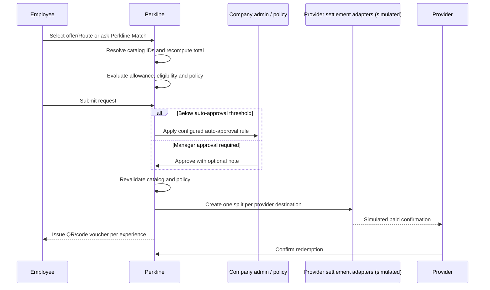

# Benefit payment flow

## Destination behavior

| Type | Inputs | Persisted |
|---|---|---|
| Employee Perkline Credit | None | Internal wallet ID, currency, status |
| Provider bank settlement | Business name, country, currency, IBAN, conditional BIC | Masked IBAN, BIC, status |
| PayPal Business | Verified business email through simulated connect | Masked email, connection state |
| Hosted card processor | No raw card fields; simulated hosted setup | Processor account token, connection state |

Switching type resets the draft, so irrelevant fields cannot survive. Crypto is not available in
benefit settlement or voucher redemption.

## Production note

All movement is simulated. Production requires licensed payment partners, KYB/KYC, AML/sanctions
review, durable ledgering, signed provider webhooks and jurisdiction-specific welfare/tax review.

